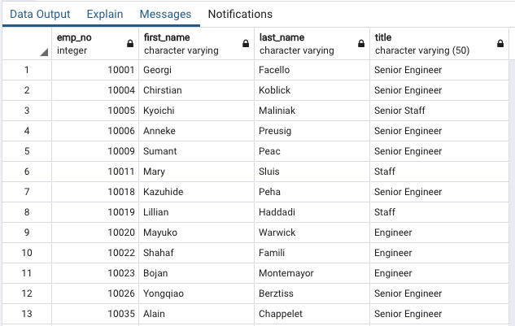

# Pewlett Hackard Analysis Challenge

## Overview
The purpose of this analysis is to find out the number of employees by title and finally to identify the number of employees who fall under the category of mentorship eligibility program based on their seniority.

## Results
Following points can be inferred from the first deliverable:
- Majority of the retiring titles are "Senior Engineers" and "Senior Staff".
- Very few of the retiring titles are from management positions.
    
    

- This is also evident by looking at a glance at the following table of "unique_titles" from retiring employees that most of the retiring employees are from "Senior Engineer" title:

    

- We can also conclude that there are few employees who are at "Manager" level positions, so either there is very little interest in "Senior Staff" opting for "Manager" level positions or the promotions are disproportionate.

## Summary
Following query can be run in order to find out total retiring employees:

SELECT SUM (count) as total_retiring_employees
FROM retiring_titles;

This give us the total number of roles that need to be filled:
     

Now we can run the following query to identify how many employees are retirement-ready:

SELECT COUNT(emp_no) as retirement_ready
FROM mentorship_eligibilty;

As we can see there are clearly not enough mentors available to train newly hired employees. 

